<div align="center">



</div>

---


### `$ cat about_me.json`

```json
{
  "name"    : "Sunil Kumar Reddy",
  "role"    : "Data Engineer",
  "location": "Bangalore, India",
  "clouds"  : ["AWS ☁", "GCP ☁", "Azure ☁"],
  "certs"   : [
    "AWS Certified Data Engineer Associate",
    "Databricks Certified Data Engineer Associate"
  ],
  "events_per_day" : "2,120,000+",
  "pipelines_built": 6,
  "oss_prs_merged" : 2,
  "clouds_covered" : 3,
  "uptime"         : "99.97%",
  "available"      : true
}
```

<br clear="right"/>

---

## `$ ls -la ./projects`

> 6 production-grade streaming pipelines · AWS · Azure · GCP · Multi-Cloud · 2,120,000+ daily events

---

### 🔴 P1 — Real-Time Fraud & Anomaly Detection · AWS


> **Stack:** Apache Kafka · Spark Structured Streaming · PySpark · Amazon S3 · Redshift · Python · Parquet

**The Problem:** Traditional fraud detection runs in batch mode — detecting fraud 4-6 hours after it happens. Money is already gone. Accounts already compromised.

**What I Built:** A Kafka-to-Spark streaming pipeline ingesting 120K+ simulated daily transaction events — reducing fraud detection latency from batch hours to under 60 seconds, with exactly-once semantics and zero data loss.

| Metric | Result |
|:-------|:------:|
| Daily Events | **120K+** |
| Latency | Batch hours → **< 60s** |
| Pipeline Failures | **↓ 80%** |
| Query Time | **↓ 40%** |
| Data Loss | **0** |

**Key concept learned:** Exactly-once semantics is an architecture decision — not a feature you add later. Kafka idempotent producer + Spark checkpoint + Redshift MERGE = zero duplicates.

[](https://github.com/sunildataengineer/Real-Time-Fraud-Anomaly-Detection-Streaming-Platform)

---

### 🔵 P2 — Real-Time Data Quality & Streaming Governance · Azure



> **Stack:** Azure Event Hubs · Databricks · Delta Lake · PySpark · Azure Data Factory · Python

**The Problem:** Bad data silently corrupts every downstream system — wrong dashboards, broken ML models, compliance risk. Most companies catch it after it reaches the warehouse.

**What I Built:** A medallion architecture platform (Bronze→Silver→Gold) enforcing 6 data quality rules at ingestion — 200K+ daily records validated with full quarantine audit trail and schema evolution support.

| Metric | Result |
|:-------|:------:|
| Daily Records | **200K+** |
| Downstream Rejections | **↓ 40%** |
| Recovery Time | **↓ 30%** |
| Delta Layers | **3 (B→S→G)** |
| Data Loss | **0** |

**Key concept learned:** Bronze immutability is your safety net. When a quality rule has a bug, you fix the rule and replay from Bronze. Without immutability, bad data decisions are permanent.

[](https://github.com/sunildataengineer/Real-Time-Data-Quality-Streaming-Governance-Platform)

---

### 🟢 P3 — Global Real-Time Event Processing · GCP



> **Stack:** Google Pub/Sub · Apache Beam · Cloud Dataflow · BigQuery · Python · SQL

**The Problem:** Users across 3 global regions generate events that arrive out-of-order due to network delays. Naive processing gives wrong aggregations. Late-arriving events are silently dropped.

**What I Built:** A stateful streaming platform processing 300K+ daily events across multi-region with event-time windowing, 2-minute watermark tolerance, and 3 window types — Fixed, Sliding, and Session.

| Metric | Result |
|:-------|:------:|
| Daily Events | **300K+ (3 regions)** |
| Latency | **< 60 seconds** |
| Accuracy Gain | **+30%** (event-time) |
| Query Speedup | **↓ 45%** |
| Data Loss | **0** |

**Key concept learned:** Window type must match the business question. Fixed windows broke session analysis — a 3-minute user session fell across two windows. Session windows fixed it permanently.

[](https://github.com/sunildataengineer/Global-Real-Time-Event-Processing-Stateful-Streaming-Platform)

---

### 🟠 P4 — Real-Time CDC & Database Replication · AWS


> **Stack:** Debezium · Apache Kafka · Apache Spark · PostgreSQL · Snowflake · AWS S3 · PySpark · Python

**The Problem:** Every INSERT, UPDATE, DELETE in your production database — does your analytics warehouse know? Without CDC, the answer is NO until the next batch job. Analytics stays 24 hours stale.

**What I Built:** A Change Data Capture pipeline using Debezium to capture 500K+ simulated PostgreSQL change events/day via WAL logs, process before/after images in Spark, and MERGE into Snowflake with exactly-once guarantees.

| Metric | Result |
|:-------|:------:|
| Change Events/Day | **500K+** |
| CDC Latency | **< 2 seconds** |
| Tables Tracked | **3 (orders · users · products)** |
| Sync Accuracy | **100%** |
| Audit History | **∞ (immutable S3)** |
| Data Loss | **0** |

**Key concept learned:** Schema changes are the hardest CDC problem. When a column is added mid-stream, Debezium emits a schema change event. If Spark doesn't handle it — pipeline crashes. Built auto-detection that pauses, migrates, and resumes with zero data loss.

[](https://github.com/sunildataengineer/Real-Time-CDC-Database-Replication-Pipeline)

---

### 🟣 P5 — Real-Time ML Feature Store Pipeline · AWS


> **Stack:** Apache Kafka · Apache Spark · Redis · AWS S3 · PostgreSQL · PySpark · Python · Great Expectations

**The Problem:** When Netflix recommends a show — it needs your last-hour watch history, not last week's. When a bank scores a loan — it needs 30-day transaction behaviour in real time. This requires a Feature Store.

**What I Built:** A dual-store ML Feature Store pipeline engineering 400K+ simulated user events/day into 10+ ML-ready features — Redis online store for sub-10ms serving, S3 offline store for training, with feature drift detection.

| Metric | Result |
|:-------|:------:|
| Events/Day | **400K+** |
| Online Latency | **< 10ms** (Redis) |
| Features Computed | **10+** (7d/30d windows) |
| Drift Detection | **✅ Active** |
| Training-Serving Skew | **0** |
| Data Loss | **0** |

**Key concept learned:** Feature drift detection bridges Data Engineering and MLOps. A shifted feature distribution means the ML model trained on old data may give wrong predictions — catching this early prevents silent model degradation.

[](https://github.com/sunildataengineer/Real-Time-ML-Feature-Store-Streaming-Pipeline)

---

### ⚪ P6 — Multi-Cloud Real-Time Data Lakehouse · AWS + GCP


> **Stack:** Apache Kafka · Apache Spark · Apache Iceberg · AWS S3 · GCP BigQuery · Trino · dbt · PySpark · Python · SQL

**The Problem:** Financial data on GCP. E-commerce data on AWS. Analytics team needs to JOIN them in one SQL query. Most architectures make this impossible. Vendor lock-in forces a choice.

**What I Built:** A multi-cloud Data Lakehouse spanning AWS S3 and GCP BigQuery using Apache Iceberg as the open table format — processing 600K+ simulated daily events with cross-cloud Trino SQL queries and dbt transformations.

| Metric | Result |
|:-------|:------:|
| Events/Day | **600K+ (2 clouds)** |
| Cross-Cloud Latency | **< 60s** |
| Query Speedup | **↓ 60%** (compaction) |
| dbt Models | **Bronze→Silver→Gold** |
| Vendor Lock-in | **0** |
| Time Travel | **∞** (Iceberg snapshots) |

**Key concept learned:** The small files problem is production's silent killer. Streaming writes accumulate thousands of small Iceberg files. After 1 week — 3x query slowdown. Scheduled Iceberg OPTIMIZE every 6h via Airflow — queries fast permanently.

[](https://github.com/sunildataengineer/Multi-Cloud-Real-Time-Data-Lakehouse---Apache-Iceberg)

---

## 📊 Portfolio Scale

```
P1  Fraud Detection    AWS          120,000+  events/day
P2  Data Quality       Azure        200,000+  records/day
P3  Global Events      GCP          300,000+  events/day
P4  CDC Pipeline       AWS          500,000+  change events/day
P5  ML Feature Store   AWS          400,000+  events/day
P6  Multi-Cloud        AWS + GCP    600,000+  events/day
─────────────────────────────────────────────────────────
    TOTAL                         2,120,000+  events/day
    CLOUDS                        AWS · Azure · GCP
    TABLE FORMATS                 Delta Lake · Apache Iceberg
    QUERY ENGINES                 Redshift · BigQuery · Trino · Snowflake
```

---

## `$ cat tech_stack.yaml`

```yaml
languages:
  - Python            # pandas, PySpark, Apache Beam, ETL scripting
  - SQL               # window functions, CTEs, query optimization

streaming:
  - Apache Kafka      # consumer groups, offset management, exactly-once
  - Debezium          # CDC, WAL capture, before/after images
  - Azure Event Hubs
  - Google Pub/Sub

processing:
  - Apache Spark      # structured streaming, checkpointing, UPSERT
  - PySpark
  - Azure Databricks
  - Apache Beam       # windowing, watermarking, stateful DoFn
  - Google Dataflow

storage:
  - Apache Iceberg    # open table format, time travel, compaction
  - Delta Lake        # medallion architecture, schema evolution
  - Redis             # online feature store, sub-10ms serving
  - Amazon S3         # parquet-partitioned, offline feature store
  - Amazon Redshift
  - Google BigQuery
  - Snowflake         # MERGE, exactly-once upserts

transformation:
  - dbt               # Bronze→Silver→Gold, lineage, tests

query_engines:
  - Trino             # cross-cloud SQL, Iceberg federation

cloud:
  - AWS               # S3, Redshift, Glue, Kinesis
  - GCP               # Pub/Sub, Dataflow, BigQuery
  - Azure             # Event Hubs, Databricks, Data Factory

data_quality:
  - Great Expectations # feature validation, streaming expectations

observability:
  - OpenTelemetry     # distributed tracing (Apache Airflow OSS PR)
  - Structured Logging
  - Prometheus
```

---

## `$ cat certifications.txt`

```
┌──────────────────────────────────────────┬──────────────────────────────────────────┐
│  ☁  AWS Certified Data Engineer          │  ▣  Databricks Certified Data Engineer   │
│     Associate                            │     Associate                            │
│     Amazon Web Services · Jan 2026       │     Databricks · Feb 2026               │
│     Status: ██████████  ACTIVE ✓         │     Status: ██████████  ACTIVE ✓        │
└──────────────────────────────────────────┴──────────────────────────────────────────┘
```

---

## `$ git log --open-source`

### Apache Airflow — 2 Merged PRs

> Apache Airflow is the world's most popular workflow orchestration platform — used by Airbnb, Slack, Twitter, and 10,000+ companies.

**PR 1 — Deferrable HttpSensor (2024)** `MERGED`
- Added async execution to Airflow's HttpSensor using the Triggerer framework
- Tasks suspend and release worker slots during HTTP polling instead of blocking
- Improves pipeline scalability at zero infrastructure cost

**PR 2 — OpenTelemetry HTTP Distributed Tracing (2025)** `MERGED`
- Added W3C-standard OTel span instrumentation to `HttpHook.run()`
- HTTP calls are now visible in distributed traces for the first time in Airflow history
- Injected `traceparent` headers for end-to-end tracing across system boundaries

---

## 📊 GitHub Stats

<div align="center">

[](https://github.com/sunildataengineer)

</div>

---

## `$ git log --oneline --all`  *(current sprint)*

```
🟢 [NOW]  MySQL mastery — window functions, CTEs, FAANG patterns
🟢 [NOW]  Python for Data Engineering — Pandas, OOP, ETL scripting
🟢 [NOW]  Building P4: Real-Time CDC Pipeline (Debezium + Snowflake)
⬜ [NEXT] P5: ML Feature Store (Redis dual-store architecture)
⬜ [NEXT] P6: Multi-Cloud Iceberg Lakehouse (Trino + dbt)
⬜ [NEXT] Great Expectations OSS contribution (3rd merged PR)
⬜ [GOAL] First Data Engineer offer — August 2026 🎯
```

---

<div align="center">

**→ Open to Data Engineer roles — Bangalore · Remote · Hybrid**

[](https://www.linkedin.com/in/suniil-data-engineer/)
[](https://sunildataengineer.netlify.app/)
[](mailto:sunildataengineer@outlook.com)
[](https://leetcode.com/u/sunildataengineer/)

*"Bad pipelines fail silently. Good engineers don't let them."*

</div>
